name: inverse
class: left, middle
layout: true
background-image: url(background_main.png)
background-size: cover

---

layout: true
class: top, left, bg
<!-- the default layout -->

---
template: inverse

# Storage on Kubernetes
## Learning From Failures
Hemant Kumar, Jan Šafránek<br/>
Red Hat

---
# TODO: agenda / intro

---

template: inverse
# Data lost during migration

---

# Data lost during migration
## What happened?

1. User moves PV an PVC objects from "testing" to "production" clusters.
    ```shell
    $ kubectl get pv -o yaml > pvs.yaml
    $ kubectl get pvc -o yaml > pvcs.yaml
    
    $ kubectl apply -f pvs.yaml
    $ kubectl apply -f pvcs.yaml
    ```
2. **Kubernetes deletes PV and the volume in storage backend.**

---

# Data lost during migration
## Why?

.center[
  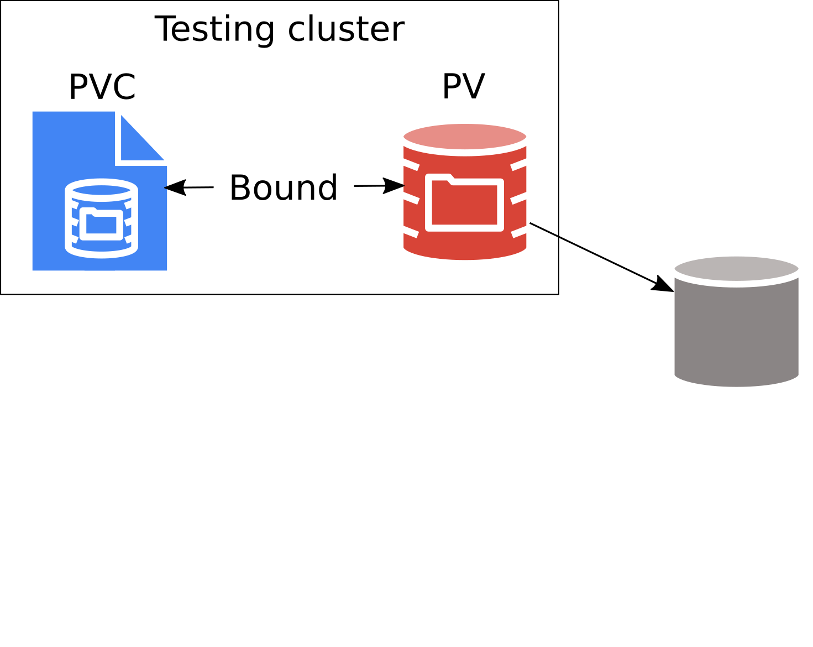<br/>
]

---

# Data lost during migration
## Why?

.center[
  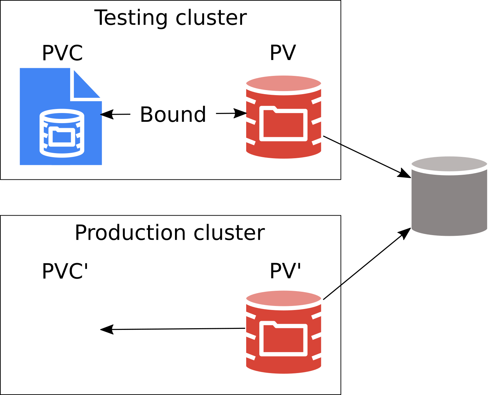<br/>
]

---

# Data lost during migration
## Why?

.center[
  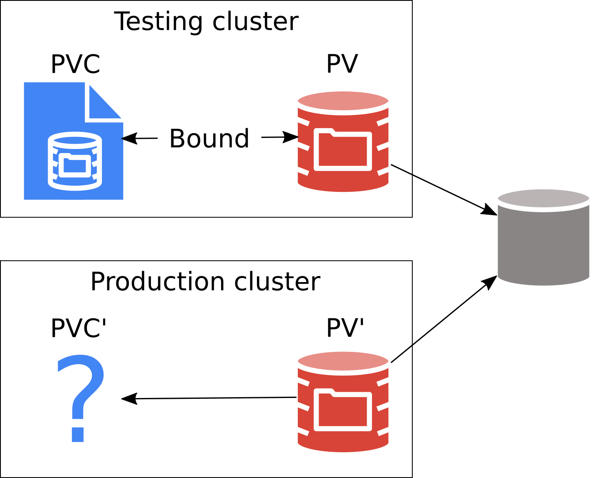<br/>
]

---

# Data lost during migration
## Why?

.center[
  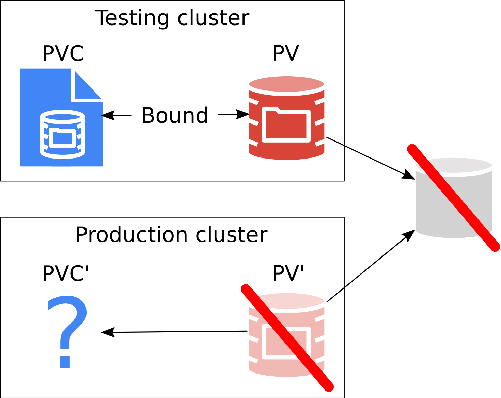<br/>
]

---

# Data lost during migration
## PVC first
.center[
  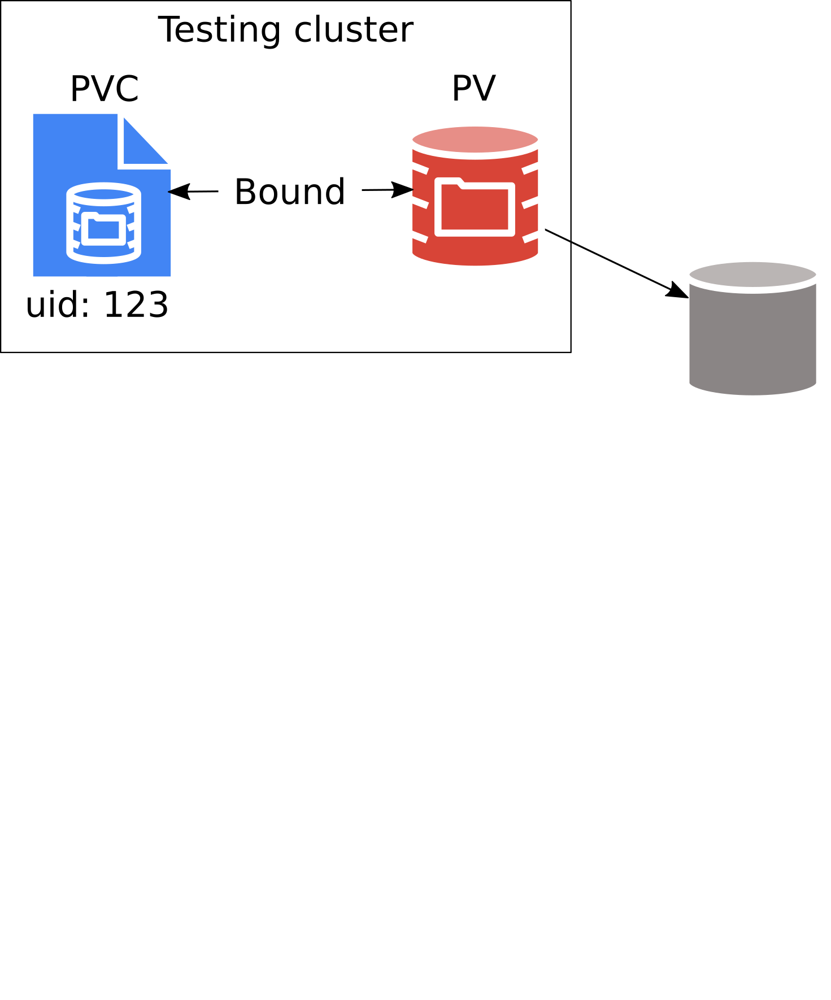<br/>
]

---

# Data lost during migration
## PVC first
.center[
  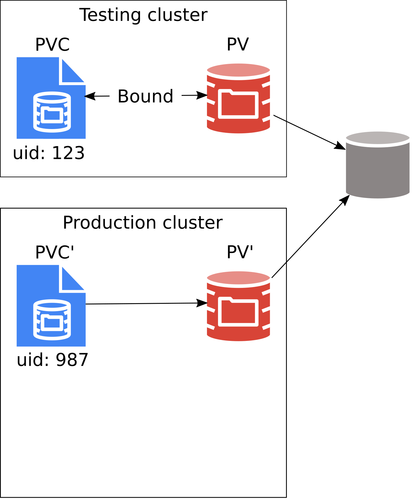<br/>
]

---

# Data lost during migration
## PVC first
.center[
  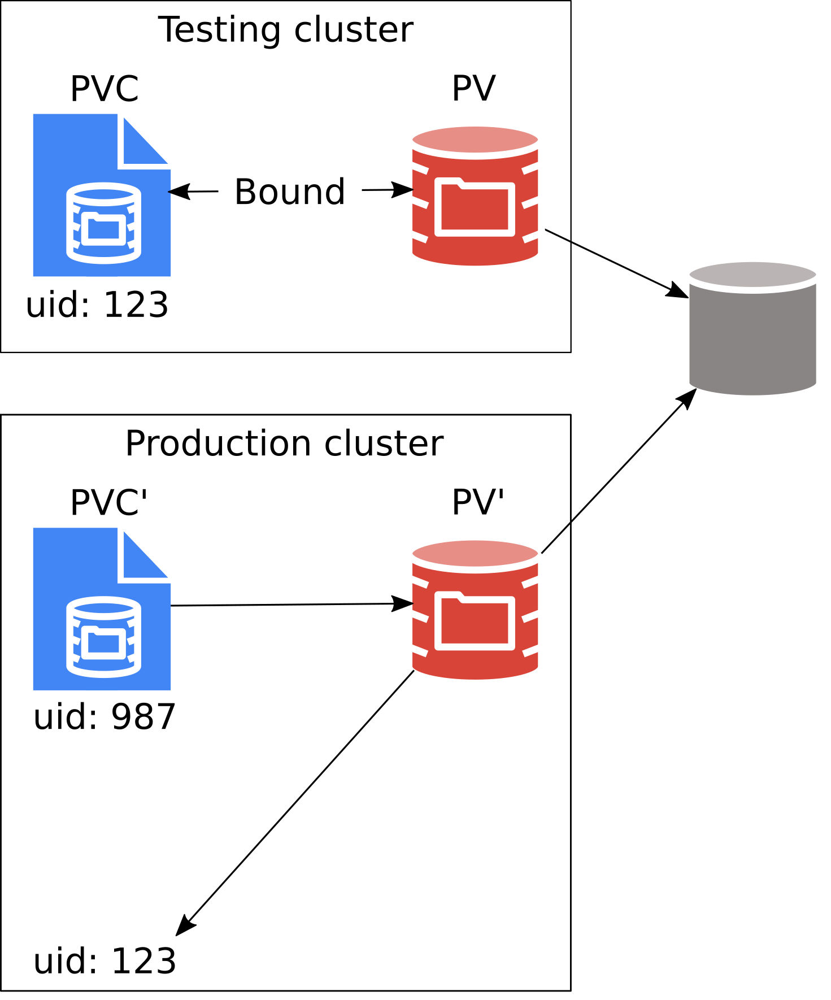<br/>
]

---

# Data lost during migration
## PVC first
.center[
  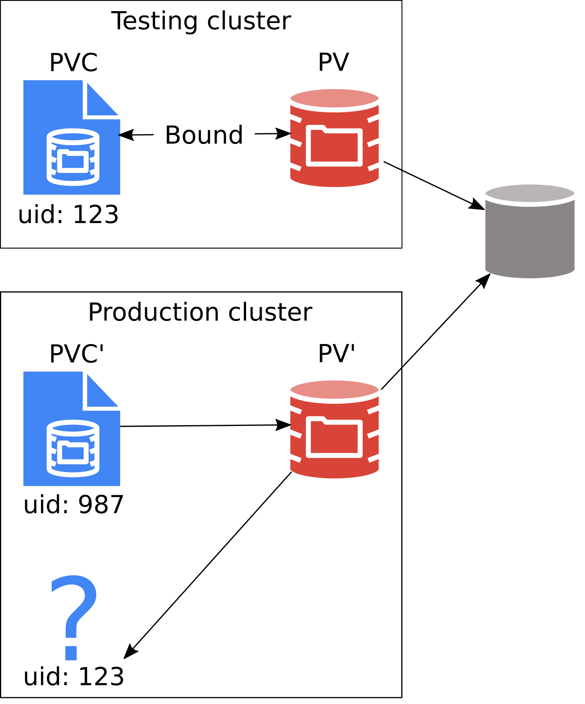<br/>
]

---

# Data lost during migration
## PVC first
.center[
  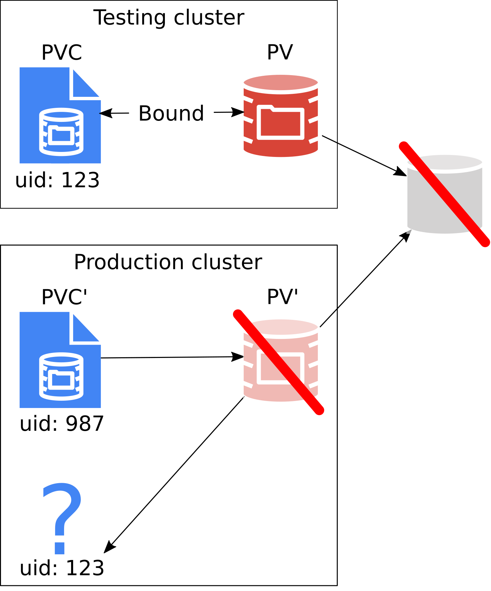<br/>
]

---

# Data lost during migration
## It's not a bug, it's a feature!

* Do regular backups!
* Use dedicated tools for migration, such as Ark / Velero.
  * *How to Backup and Restore Your Kubernetes Cluster - Annette Clewett & Dylan Murray, Tuesday 4:25pm.*
* Consider using `PersistentVolumeReclaimPolicy: Retain`.
  * Perhaps with a custom controller / operator that deletes the volumes after review, backup and / or grace period.

--

## Lessons learned: better documentation!

---

template: inverse
# CVE-2017-1002101
# *Subpath volume mount handling allows arbitrary file access in host filesystem*

---

# CVE-2017-1002101
## What happened?

*"Subpath volume mount handling allows arbitrary file access in host filesystem"*

A pod can get access to full host filesystem, including:
  * Container runtime socket.
  * Any Secrets present on the node.
  * Any Pod volume present on the node.
  * ...

--
## Why?
* Symlinks created *in a pod* were evaluated *outside of the pod*.

---

# CVE-2017-1002101
## How we fixed it?

KubeCon NA 2018: [How Symlinks Pwned Kubernetes (And How We Fixed It) - Michelle Au, Google & Jan Šafránek, Red Hat](https://events19.linuxfoundation.org/events/kubecon-cloudnativecon-north-america-2018/schedule/).

--
## Lessons learned

* Don't trust user.
* Containers can introduce security issues not seen before.
* Kubernetes Security Response Team (aka Product Security Committee) works and is helpful. 

---

template: inverse
# Corrupted filesystem on ReadWriteOnce volumes

---

# Corrupted filesystem on ReadWriteOnce volumes
## Story of two bugs, two years apart:

* Nobody wants this in their Kernel logs

```shell
[2480314.265276] XFS (dm-43): Unmounting Filesystem
[2480314.543698] device-mapper: ioctl: remove_all left 68 open device(s)
[2480342.623544] XFS (dm-7): Metadata corruption detected at xfs_inode_buf_verify
[2480342.623703] XFS (dm-7): Unmount and run xfs_repair
[2480342.623786] XFS (dm-7): First 64 bytes of corrupted metadata buffer:
```

--
* Kubernetes/Openshift version - 1.10/3.10
--
* Volume type: Fiber channel
--
* Reported on: November 2017

---


# Corrupted filesystem on ReadWriteOnce volumes

* And neither we want this in our Kernel logs

```shell
Aug 26 22:34:57.001029 ip-10-0-6 kernel: XFS (rbd0): Metadata corruption detected at xfs_dir
Aug 26 22:34:57.001213 ip-10-0-6 kernel: XFS (rbd0): Unmount and run xfs_repair
Aug 26 22:34:57.001342 ip-10-0-6 kernel: XFS (rbd0): First 128 bytes of corrupted metadata
```
--
* Kubernetes/Openshift version - 1.14/4.2
--
* Volume type: Ceph-RBD via CSI/Rook
--
* Reported on: August 2019

---

# Corrupted filesystem on ReadWriteOnce volumes
## So what are AccessModes?
--
* ReadWriteOnce
--
* ReadWriteMany
--
* ReadOnlyMany
--

## You can request a volume of specific AccessMode while creating a PVC:

```yaml
kind: PersistentVolumeClaim
apiVersion: v1
metadata:
  name: myclaim
spec:
  accessModes:
    - ReadWriteOnce
  resources:
    requests:
      storage: 1Gi

```

---
name: text-slide
background-image: url(slide_text.png)
background-size: cover

# Corrupted filesystem on ReadWriteOnce volumes
* Kubernetes did not enforce AccessModes at all until version 1.7/1.8
--
  - You could always create two pods that use same volume but could be mounted on two different nodes.
--
  - In cases where Storage Provider did not had any protection/fencing - it caused problems.
--

* We implemented control-plane based enforcing of AccessModes.

---
name: text-slide
background-image: url(slide_text.png)
background-size: cover

# Corrupted filesystem on ReadWriteOnce volumes
## But those two bugs are newer - 1.10 and 1.14!

--
## Limitations of AccessMode enforcement in Kubernetes
--
* It only works for volume types that are Attachable.
--
* It does not prevent 2 pods from using same volume on same node.
--
* It is based on cached volume state in controller-manager. 

---
name: text-slide
background-image: url(slide_text.png)
background-size: cover

# Corrupted filesystem on ReadWriteOnce volumes
## Attachable volumes:
* AWS EBS
* GCE PD
* vSphere disks
* CSI volume that does have `PUBLISH_UNPUBLISH_VOLUME` capability.

--
## Volume types which are not attachable:
* iSCSI
* Ceph-RBD
* Fiber Channel
* CSI volume that does not have `PUBLISH_UNPUBLISH_VOLUME` capability.

---
name: text-slide
background-image: url(slide_text.png)
background-size: cover
# Corrupted filesystem on ReadWriteOnce volumes
## Fix for non-attachable volumes(in-tree)
--
* Implement a dummy `Attach` and `Detach` interface which is basically a NOOP for `iSCSI`, `FC` and `Ceph-RBD`.
--
* This would basically turn non-attachable volume types into attachable.
--
* It will ensure that volume is made available on a node via control-plane attach/detach controller and not directly.

---
name: text-slide
background-image: url(slide_text.png)
background-size: cover
# Corrupted filesystem on ReadWriteOnce volumes
## Recommendations for CSI Volumes
* Whenever possible implement strong control-plane based fencing for publishing volumes to a node.
--
  - Pushes the problem back to storage provider from Kubernetes.
--
  - May not be possible in some cases where an off-the-shelf storage solution is deployed.
--

* External-Attacher CSI sidecar can support NOOP attach/detach of volumes which don't have `CONTROLLER_PUPLISH_UNPUBLISH` capability.
--
  - Ensure that external-attacher is running even if CSI driver does not support attach/detach.
--
  - Do not disable attach/detach from `CSIDriver` object.


---

template: inverse
# Data on `PersistentVolume` wiped after kubelet restart

---

# Data on PV wiped after kubelet restart
## What happened?

* Kubelet is offline and a running pod is deleted in the API server.
* Newly (re)started kubelet deletes all data on a volume that the pod used.

--

## Why?

* Newly (re)started kubelet does not see the pod in API server.
  * kubelet did not unmount the volume.
  * Orphan directory scan removed all files in presumably empty pod directory. 

---

# Data on PV wiped after kubelet restart
## How we fixed it?

* Verify all `os.RemoveAll` in Kubernetes.
  * Never delete orphan directories across filesystem boundary.
* Introduce *reconstruction* - scan `/var/lib/kubelet/pods` on kubelet start and reconstruct caches.
  * Still fixing bugs there :-).

--

## Lessons learned

* Introduced `[Distuptive]` tests for kubelet restart.

---

template: inverse
# Data on `PersistentVolume` wiped after kubelet restart *again*

---

# Data on PV wiped after kubelet restart *again*
## What happened?

* A directory on the root disk used as local volume wiped out.
* Same scenario as above.

--

## Why?

* Root disk used as a local volume does not introduce filesystem boundary.
* The local volume was used with `SubPath` feature.

--

## How we fixed it?

* Check for SubPath volumes before removing orphan directories.

--

## Lessons learned

* Introduce `[Disruptive]` tests for kubelet restart with `SubPath`.

---

template: inverse
# Volumes are recycled while they are used by pods

---

# Volumes are recycled while they are used by pods
## What happened?

* User deletes PVC while it's still used by a pod.
* All data on the volume are wiped.

---

# Volumes are recycled while they are used by pods
## Why?
* Kubernetes has no referential integrity.

.center[
  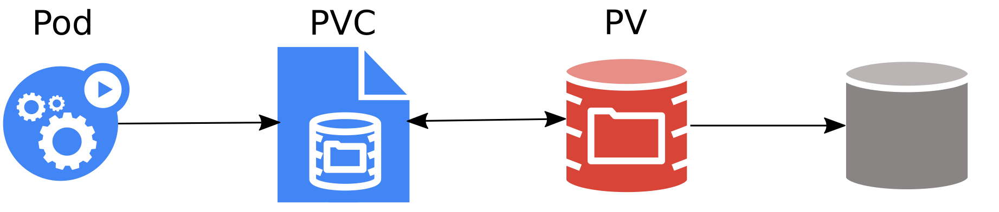<br/>
]

---

# Volumes are recycled while they are used by pods
## Why?

.center[
  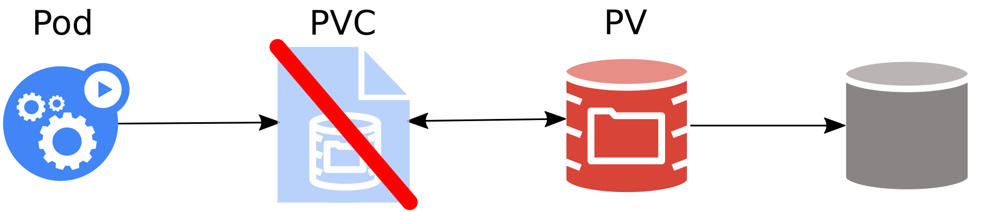<br/>
]

---

# Volumes are recycled while they are used by pods
## Why?

.center[
  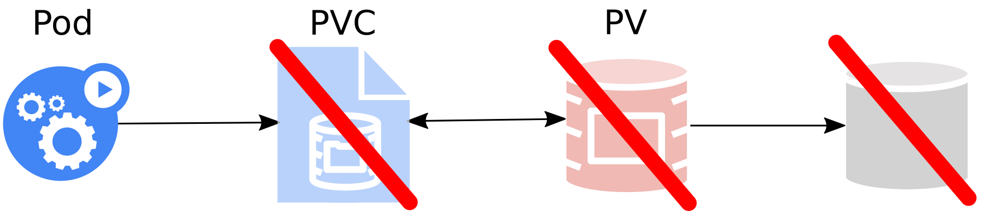<br/>
]

---

# Volumes are recycled while they are used by pods
## How we fixed it?
* Using `Finalizers`.
* StorageInUseProtection admission plugin and controller.

.center[
  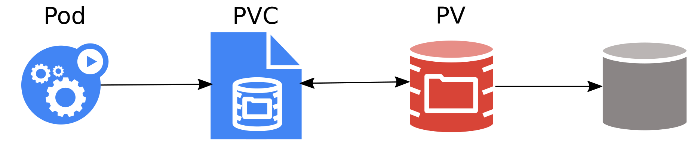<br/>
]

---

# Volumes are recycled while they are used by pods
## How we fixed it?
* Using `Finalizers`.
* StorageInUseProtection admission plugin and controller.

.center[
  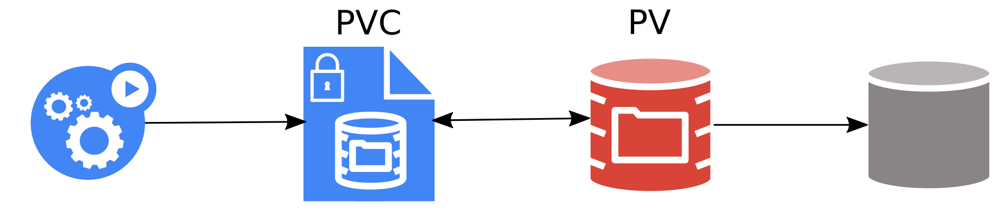<br/>
]

---

# Volumes are recycled while they are used by pods
## How we fixed it?
* Using `Finalizers`.
* StorageInUseProtection admission plugin and controller.

.center[
  <br/>
]

---

# Volumes are recycled while they are used by pods
## How we fixed it?
* Using `Finalizers`.
* StorageInUseProtection admission plugin and controller.

.center[
  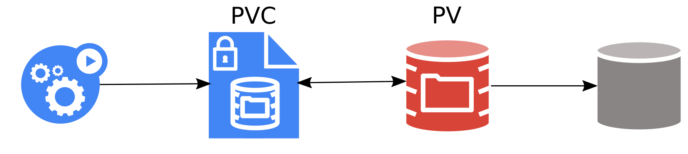<br/>
]

---

# Volumes are recycled while they are used by pods
## How we fixed it?
* Using `Finalizers`.
* StorageInUseProtection admission plugin and controller.

.center[
  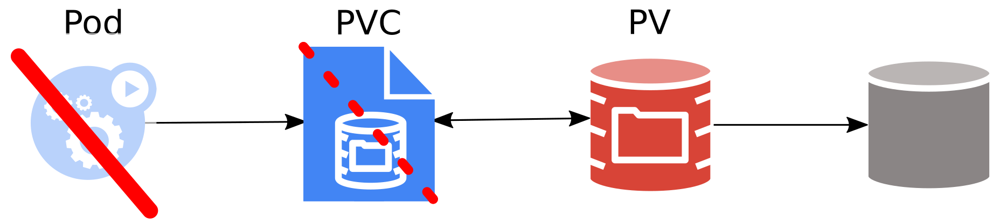<br/>
]

---

# Volumes are recycled while they are used by pods
## How we fixed it?
* Using `Finalizers`.
* StorageInUseProtection admission plugin and controller.

.center[
  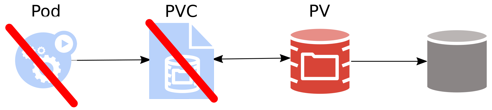<br/>
]

---

template: inverse 
# Volumes not attached / detached on AWS

---

# Volumes not attached / detached on AWS
## What happened?

* AWS EBS volume was *attaching* forever.
* AWS EBS volume was *detaching* forever.
* + similar issues.
* Very hard to reproduce.

--

## Why?

* Device allocation.
  * Re-using a device that was just released can lead to volume *attaching* forever.
  * Devices used by force-detached volumes are unusable.
* Eventual consistency.
  * Can go back in time.
* Mounted volumes cannot be detached (*detaching* forever).

---

# Volumes not attached / detached on AWS

##  How we fixed it?

* Lot of workarounds in Kubernetes AWS cloud provider.
* Still fixing it.

---

template: inverse
# Open Issues

---

# Recursive `chown`

```shell
$ kubectl explain pod.spec.securityContext.fsGroup

FIELD:    fsGroup <integer>

DESCRIPTION:
     A special supplemental group that applies to all containers in a pod. Some
     volume types allow the Kubelet to change the ownership of that volume to be
     owned by the pod [...]
```

* kubelet does recursive `chown` to set ownership of **all** files on the volume.
  * Slow on large volumes.
* Design in progress.
  * Take shortcuts? Some files may have wrong owner.
  * Make `chown` optional? Requires API change.
  * Use overlay FS? Requires the overlay installed on nodes.

---

# Detaching volumes from shutdown nodes

* Kubernetes will not automatically detach volumes from nodes which have been shutdown.
  * Kubernetes does evict Pods from shutdown nodes automatically.
  * Replacement Pods on new nodes may not be able to start if they are using Persistent volumes.

---

# Detaching volumes from shutdown nodes
## Kubernetes will not detach volumes from shutdown nodes

* Pods on shutdown node do not automatically get deleted and stay in "unknown" state.
* Kubernetes does not detach volumes from Pods in "unknown" state.

---
# Detaching volumes from shutdown nodes
## How do we recover from it?

* On cloudprovider managed clusters such as AWS, GCE - running a cluster in Autoscaling group will cause a shutdown node to be deleted and replaced.
  * Volumes are automatically detached from a deleted node.
* For bare-metal clusters or cloudproviders that don't allow easy replacement of a node, this is a bigger problem.
  * An external controller can monitor for shutdown nodes and force delete pods in "unknown" state from those nodes.
* Kubernetes community is working on a design consensus that should solve this for good.


---

# Volume reconstruction

TODO: remove? It's covered in one of the fixed issues.

* kubelet reconstructs caches from `/var/lib/kubelet/pods`.
  * TODO: add example?
  * Mostly works and is actively supported!
* There should be a real database / checkpointing.
  * Current kubelet checkpoints do not include PVCs / PVs.

---

# `EmptyDir` volumes share I/O

* `EmptyDir` shares I/O bandwidth with the system and all other pods.
* Rogue pod may trash I/O performance for the others.
* TODO: check?


---
# Junkyard

---

template: inverse
# Not fixable issues

---
# `PersistentVolumeClaim` naming

* `Pod` is not `CPUAndMemoryClaim`.
--
* `Service` is not `LoadBalancerClaim`.
--
* `Volume` **is** `PersistentVolumeClaim` ???

--

"Fixed" in `VolumeSnapshot` & `VolumeSnapshotContent`.

---

# `AccessModes`

* `ReadWriteOne`, `ReadWriteMany`, `ReadOnlyMany`
* Enforced only lightly in A/D controller!
  * Multiple pods can still use single `ReadWriteOne` volume on the same node.
* Fix would break behavior.
